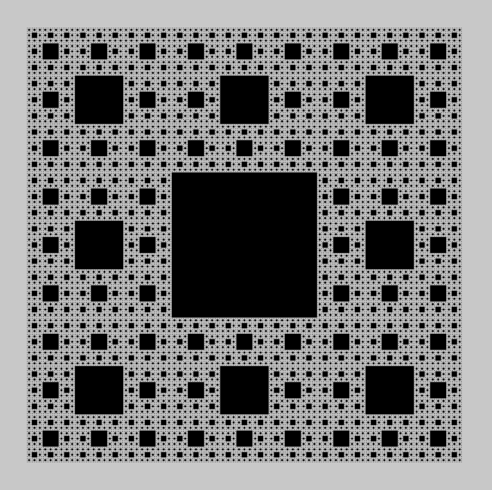

### Sierpinski Plane Fractal in P5.js

The construction of the Sierpinski carpet begins with the square. The square is cut into 
nine congruent sub squares in a three-by-three grid, and the central subsquare is removed. 
The same procedure is then applied recursively to the remaining aid subsquares until we get
down to pixel level where we have to stop. 

